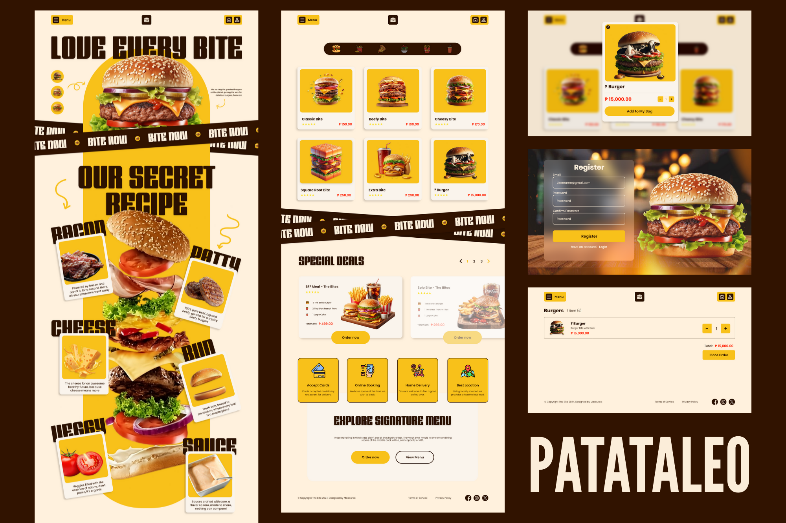

# 🍔 The Bite Fast Food Website Design

A modern and visually appealing **web design concept** for a fast-food website.  
This project showcases the layout, color scheme, and design elements suitable for a restaurant’s online presence.

---

## 🎨 Design Preview

### Mockup

### Pages

---

## 📝 About
This design concept focuses on:  
- **User-Friendly Layout:** Clear navigation and structured content.  
- **Responsive Design:** Suitable for desktop, tablet, and mobile screens.  
- **Visual Appeal:** Bright colors, appetizing imagery, and engaging interface.

---

## ⚙️ Tools Used
- Adobe XD
- Color palette inspiration: #311300, #FFF1DD, #F8C11A

---
